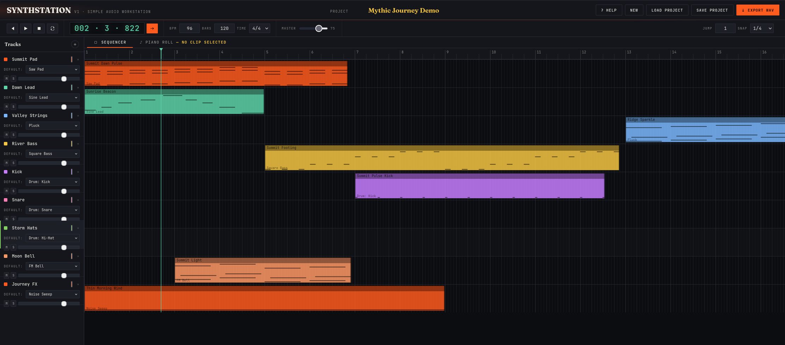

# SYNTHSTATION

Use it now: [https://synthstation.github.io/](https://synthstation.github.io/)

SYNTHSTATION is a browser-based music workstation focused on fast idea sketching. Build songs in the sequencer, edit notes in a piano roll, audition built-in synth and drum instruments, and export your track to WAV without installing anything.

## Features

- Sequencer + piano roll workflow with quick view switching.
- Built-in synth and drum instruments powered by the Web Audio API.
- Real-time clip recording with count-in and timeline follow.
- Import clips from demo projects, project files, or your local clip library.
- Project autosave and local storage support for in-browser persistence.
- One-click WAV export.

## Why use it

- Completely local: your work stays on your machine.
- Works in your browser, no need to download and install yet another app.
- Free to use.
- Open source.

## Offline support

The published site is configured as a PWA. After one successful online visit, the app shell and bundled assets are cached by a service worker so it can load offline on subsequent visits.

## AI Disclosure

The code for SYNTHSTATION is completely AI generated.
